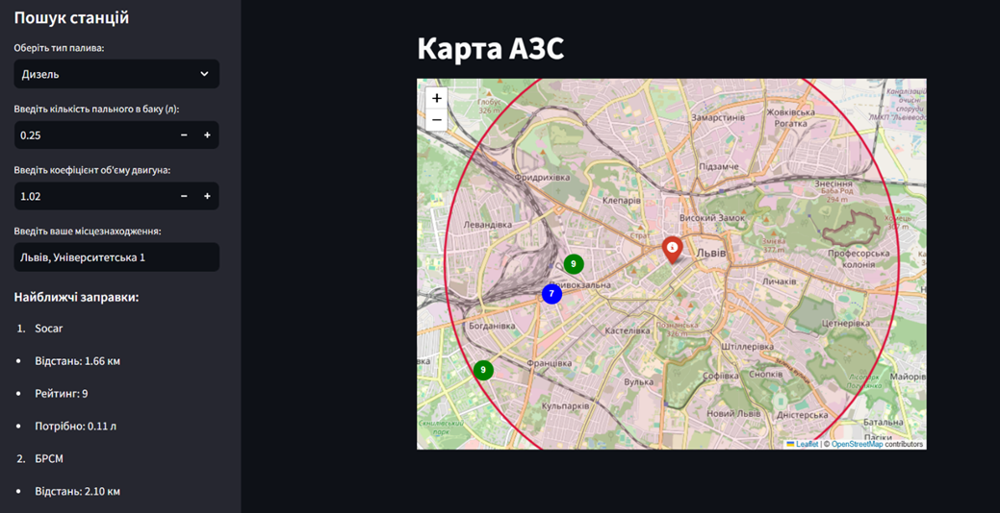

# ⛽ Карта АЗС — Геоінформаційний Застосунок

Вебзастосунок для пошуку найближчих автозаправних станцій на основі залишку пального у баку. Розроблено на мові Python з використанням фреймворку **Streamlit** та бібліотеки **Folium**.

> Курсова робота
> 
> Спеціальність 014 — Середня освіта (Інформатика), ПМОМ-11  
> Львівський національний університет імені Івана Франка

---

## 🖥️ Демонстрація



> Застосунок відображає інтерактивну карту з маркерами АЗС, кольорово закодованими за рейтингом, та колом зони досяжності автомобіля.

---

## ✨ Функціональність

- 📍 Геокодування адреси користувача через сервіс **Nominatim (OpenStreetMap)**
- 📐 Точний розрахунок відстаней за **формулою гаверсинусів** (похибка < 0,5%)
- ⛽ Автоматичний розрахунок зони досяжності на основі залишку пального та типу двигуна
- 🗺️ Інтерактивна карта з маркерами АЗС та радіусом досяжності
- 🟢 Кольорове кодування маркерів за рейтингом (зелений / синій / помаранчевий)
- 🚶 Якщо пального не вистачає — показує найближчу пішохідну АЗС з маршрутом
- 🚗 Побудова маршруту до обраної АЗС через Google Maps

---

## 🛠️ Технологічний стек

| Компонент | Бібліотека / Інструмент |
|---|---|
| Вебінтерфейс | [Streamlit](https://streamlit.io) |
| Картографія | [Folium](https://python-visualization.github.io/folium/) + Leaflet.js |
| Геокодування | [Geopy](https://geopy.readthedocs.io) / Nominatim |
| Обробка даних | [Pandas](https://pandas.pydata.org) |
| Математика | Стандартна бібліотека `math` |
| База даних | CSV-файл (`gas_stations.csv`) |

---

## 📁 Структура проєкту

```
gas_station_finder/
├── program.py           # Головний файл застосунку
├── gas_stations.csv     # Локальна база даних АЗС
└── README.md
```

---

## 🚀 Встановлення та запуск

**1. Клонуйте репозиторій:**
```bash
git clone https://github.com/kushnirolenka/Coursework2
cd Coursework2
```

**2. Встановіть залежності:**
```bash
pip install streamlit folium streamlit-folium geopy pandas
```

**3. Запустіть застосунок:**
```bash
streamlit run program.py
```

Браузер відкриється автоматично за адресою `http://localhost:8501`.

---

## 📋 Структура бази даних `gas_stations.csv`

| Поле | Тип | Опис |
|---|---|---|
| `id` | Integer | Унікальний ідентифікатор |
| `name` | String | Назва АЗС або бренд мережі |
| `latitude` | Float | Географічна широта (десяткові градуси) |
| `longitude` | Float | Географічна довгота (десяткові градуси) |
| `rating` | Integer | Рейтинг станції від 0 до 10 |

**Приклад:**
```csv
id,name,latitude,longitude,rating
1,SOCAR,49.8397,24.0297,9
2,ОККО,49.8279,24.0232,8
3,WOG,49.8450,24.0178,7
```

> ⚠️ Координати обов'язково вказуються з **крапкою**, не комою.

---

## 🧮 Математична основа

Для розрахунку відстаней використовується **формула гаверсинусів** — метрика великого кола, яка враховує сферичну форму Землі:

$$d = 2R \cdot \arcsin\left(\sqrt{\sin^2\!\left(\frac{\varphi_2 - \varphi_1}{2}\right) + \cos(\varphi_1)\cdot\cos(\varphi_2)\cdot\sin^2\!\left(\frac{\lambda_2 - \lambda_1}{2}\right)}\right)$$

де $R = 6371$ км — середній радіус Землі.

На відміну від евклідової метрики, формула коректно працює на будь-яких відстанях і враховує зближення меридіанів біля полюсів.

---

## 📖 Опис роботи

Детальний опис архітектури, алгоритмів та методичного застосування проєкту викладено у курсовій роботі:  
**«Методологічні та алгоритмічні засади розробки геоінформаційного застосунку для інтеграції у профільне навчання школярів»**

---

## 👩‍💻 Авторка

**Кушнір Оленка** — студентка групи ПМОМ-11  
Науковий керівник: **Ярошко С. А.**  
Львівський національний університет імені Івана Франка, 2026
